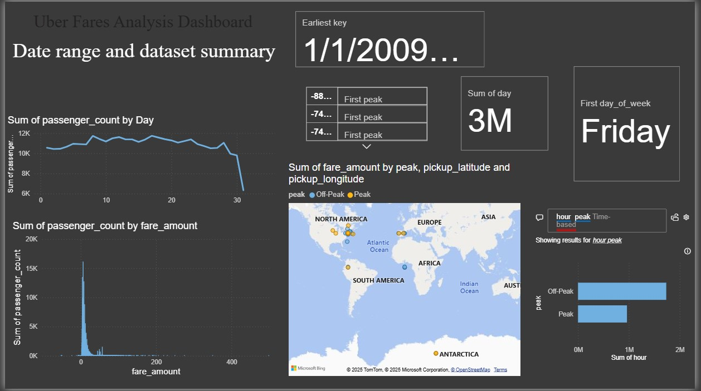
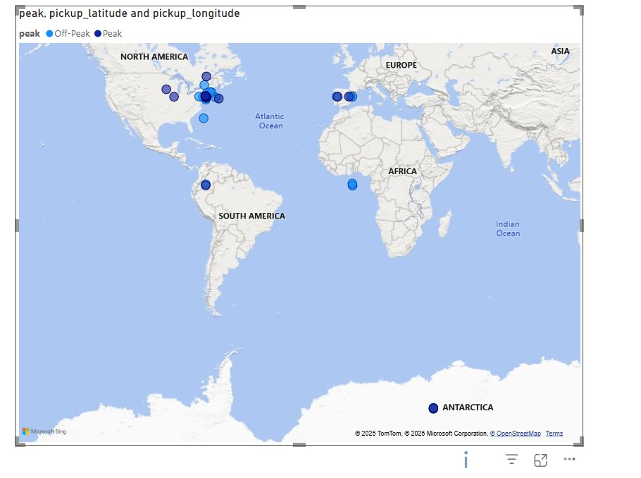

# Uber Fares Data Analysis using Python and Power BI

This README provides instructions for loading, cleaning, and analyzing the Uber Fares Dataset using Python and visualizing insights using Power BI.

First Step: Dataset Source

- download Dataset Source
  *Download the Uber Fares dataset from Kaggle:
  Uber Fares Dataset – Kaggle
  *File format: uber.csv

Second Step:Data Cleaning and Feature Engineering in Python

The following steps were performed in Python (using Pandas):

-Remove missing values
-Convert pickup_datetime to datetime format
-Extract analytical features:

     *hour
     *day
     *month
     *day_of_week
     *peak (based on rush hour: 7–9 AM and 4–7 PM)

-Save cleaned data as:

- uber_fares_cleaned.csv

Third: Import and Analyze in Power BI

-Distribution of fares

*Histogram and Box Plot
*Outlier detection and clustering

-Ride durations: Time-based analysis

    *Fare by hour, day of week, and month
    *Ride frequency by time of day

-Time series analysis: Temporal patterns and trends

     *Average fare by category

-Geographic distribution: Spatial analysis of rides

    *Pickup location maps (using latitude/longitude)
    *Interactive filters by hour, day, month, peak

The last is about the Image take in action
this picture it will show you work we made our data by using PBI

Thanks enjoy this tips
